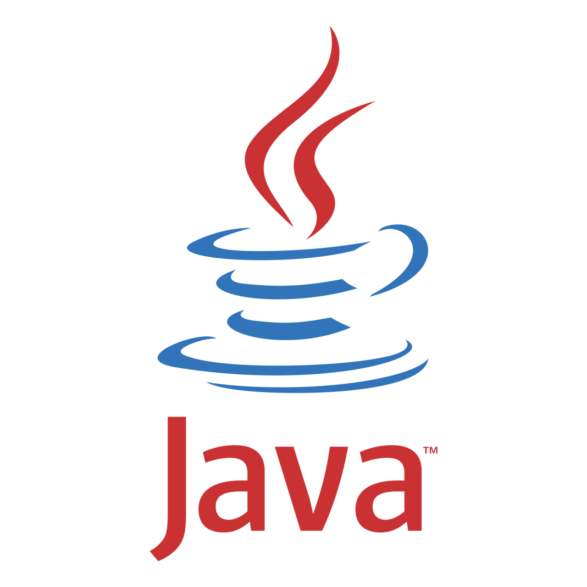

<h1>Hi there, I'm <a href="https://github.com/romanmamrukov" target="_blank">Roman</a> </h1>
<h3>Software, Games and Web developer from Latvia</h3>

 

 I currently work as a Digital assistant at Schneider Electric. Implement digital solutions.

<be>

 In my spare time, making websites for businesses, games and software solutions.

---

  
Languages

  
  
  
  
  

 
 

  
Tools

  
  
  

 
 

  
IDE

  
  
  

 

---

 

<!--
**romanMamrukov/romanMamrukov** is a ✨ _special_ ✨ repository because its `README.md` (this file) appears on your GitHub profile.

Here are some ideas to get you started:

- 🔭 I’m currently working on ...
- 🌱 I’m currently learning ...
- 👯 I’m looking to collaborate on ...
- 🤔 I’m looking for help with ...
- 💬 Ask me about ...
- 📫 How to reach me: ...
- 😄 Pronouns: ...
- ⚡ Fun fact: ...
-->
